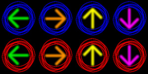

# Bequarked
A vaguely physics-themed puzzle game entirely in frontend Javascript and HTML.

Alternatively, a quirkly-looking Bejeweled clone that's clearly not as good (...yet?).

## How to Play

1. Go to [http://psiradish.github.io/Bequarked/](http://psiradish.github.io/Bequarked/).
2. Pretend you're playing [Bejeweled](https://en.wikipedia.org/wiki/Bejeweled "I am not here to tell you how to play Bejeweled").
3. Albeit with 2 players taking turns making moves on the same board (project requirement).
4. New quarks appear right where matched quarks disappear, because gravity is hard to implement in five days.
5. The winner is whoever has the highest score after both players make 3 moves (if it isn't fun yet, it can at least be short).

## Design

### Quarks (a.k.a. Gems)
+ Blue Left
+ Blue Right
+ Blue Up
+ Blue Down
+ Red Left
+ Red Right
+ Red Up
+ Red Down  

Each "quark" has an arrow that indicates the direction surrounding pieces will fall to fill the space when there is a match. Well, some day the arrows might indicate that, anyway. For now, they're just there, and the game doesn't even have standard downward gravity.

## Major Challenge(s) Ahead

It's not just gravity.  It's...

### *Variable*-melon-farming-Gravity

Take a look at this scenario:  
  

It's not unresolvable if I have the holes "take turns" being filled, but I'll have to get the order right, and figure out code that can get the order right in all the little variations of this scenario that exist, most of which I'm sure I haven't thought of.  Diagrams will probably be needed.  Lots of diagrams.

And then you have this:  
  

Which I think will just have to cause an explosion or something. But hey, explosions! Explosions are cool.

## Technology Used

+ *[jQuery](http://jquery.com/ "write less, do more.")*  
  For DOM manipulation, naturally, but also custom events. Animation is all CSS, though.
+ *[FitText.js](http://fittextjs.com/ "A jQuery plugin for inflating web type")*  
  For exactly what it says on the tin. Would be nice if they didn't obfuscate the functionality with this "compressor" nonsense and just let me pass in a percentage, though.
+ *[Bootstrap](http://getbootstrap.com/ "Designed for everyone, everywhere.")*  
  Not really, though? Just whatever `font-` properties they set on header elements that I'm too lazy to copy into my own stylesheet.

Hey, I said "though" in every one of *thoughs*.

