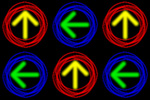
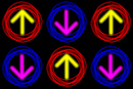

# Bequarked
A vaguely physics-themed puzzle game created entirely in frontend Javascript and HTML.

Alternatively, a quirkly-looking Bejeweled clone that's clearly not as good (...yet?).

## How to Play

+ Click on 2 adjacent quarks to try swapping their positions.
+ The swap will be successful if it results in a *match* of 3 or more quarks vertically or horizontally.
+ A failed swap has no consequences.
+ Matched quarks will disappear from the board (if you've played Bejewelled, this should sound pretty familiar so far).
+ The arrow direction on matched quarks indicates the direction surrounding quarks will fall to fill the space left behind.
+ Quarks only match if they have the *same arrow direction and ring color*.
+ The game ends after 5 successful swaps, at which point it will say you've won. Don't get too excited.

## Major Challenges

It's not just gravity.  It's...

### *Variable*-melon-farming-Gravity

Take a look at this scenario:  
  

Gravity just had to "take turns" here. And figuring out how it should do that, and then making it happen*, was not easy.  
<small>*Actually, it usually wasn't "and then" so much as "at the same time as".</small>  

And then you have this:  
  

No amount of taking turns can make this work. So I decided it would explode, taking out one or more entire lines of the board. Well, someday, anyway. For now it just breaks the game. ¬.¬  

### Still To Do

+ Iron out some bugs.
+ Fix up how the instructions are presented (so they're not squeezed into a rather small space).
+ Figure out how a game of Bejeweled ends and shamelessly copy it.
+ Animate the scoring so it's actually noticeable.
+ Show lingering "ghost arrows" in squares after quarks are matched so its easier to figure out what's going on when holes are "waiting their turn" to be filled.
+ Implement the previously-mentioned "gravity bomb" scenario.
+ Fancy up the animations further. With, like, flashes and stuff.

## Technology Used

+ *[jQuery](http://jquery.com/ "write less, do more.")*  
  For DOM manipulation, naturally, but also custom events. Animation is all CSS, though.
+ *[FitText.js](http://fittextjs.com/ "A jQuery plugin for inflating web type")*  
  For exactly what it says on the tin. Would be nice if they didn't obfuscate the functionality with this "compressor" nonsense and just let me pass in a percentage, though.
+ *[Async.js](https://github.com/caolan/async "Higher-order functions and common patterns for asynchronous code")*  
  Used on the front-end for knowing when *all* the current gravity animations (which may not all be the same length of time) have finished before doing something else. Could probably find some other places to use it, too. Async is badass.  
